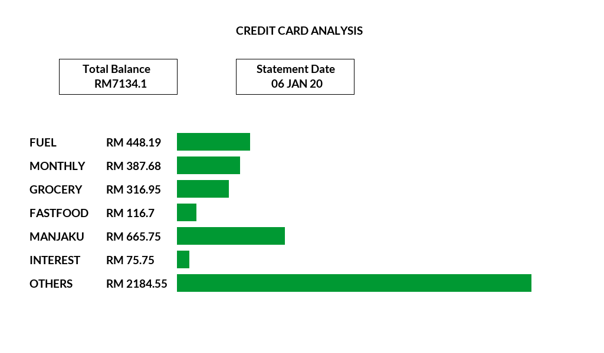

# statement-analysis
Tool to produce graphical graph of bank and credit card statements

## Environment
Whilst this tool can be used on any UNIX environment, I only use it using [termux on Android](https://play.google.com/store/apps/details?id=com.termux) because of its portability.

## Sample output


## Installation
Install `poppler` using apt
```
apt -y install poppler
```
Install `pillow` using pip
```
pip install Pillow
```
I encounter a problem during installation of `Pillow` in [termux on Android](https://play.google.com/store/apps/details?id=com.termux). These code below solves the problem.
```
LDFLAGS="-L/system/lib/" CFLAGS="-I/data/data/com.termux/files/usr/include/" pip install wheel pillow
```

## To-do
- [x] Put function in separate file an call import functions
- [x] Use `subprocess` to call `pdftotext` in shell
- [ ] Instantiate more fonts to beautify `analysis.png`
- [ ] Provide anonymous pdf file as sample
- [x] Add screenshot image in `README.md`
- [ ] Provide better name for `generate.py` to run this tool
- [ ] Provide better usage with arguments
- [ ] Better path solution for fonts in `functions.py`
